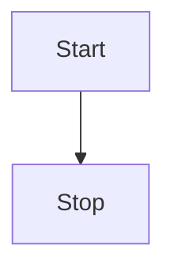
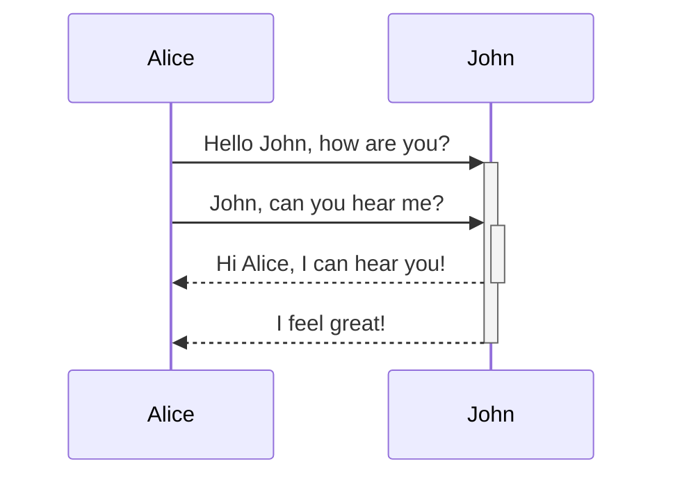
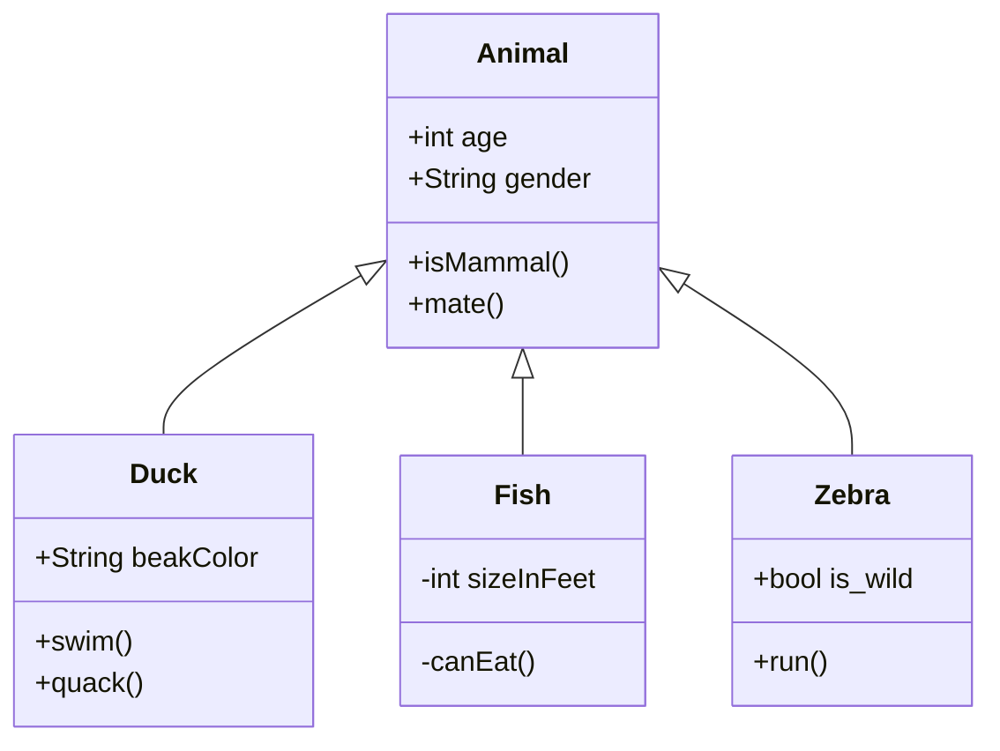
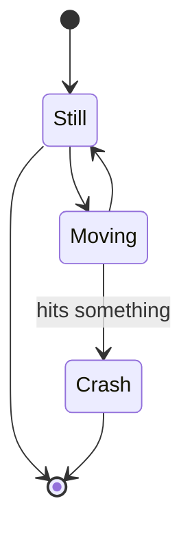
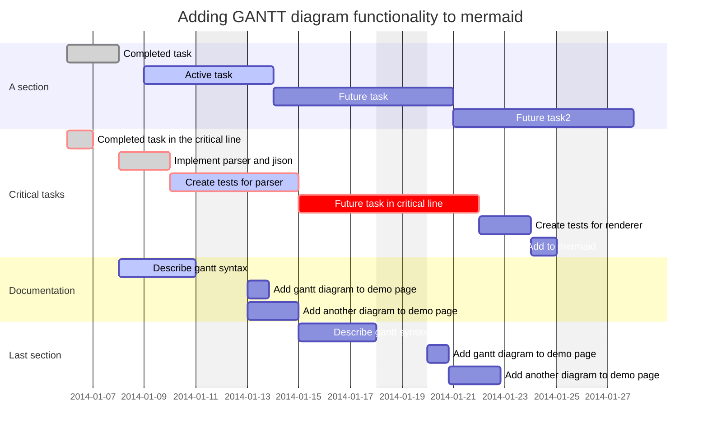
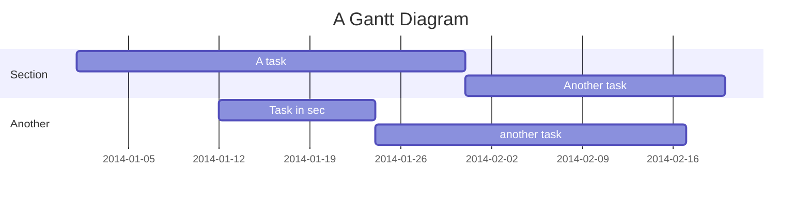
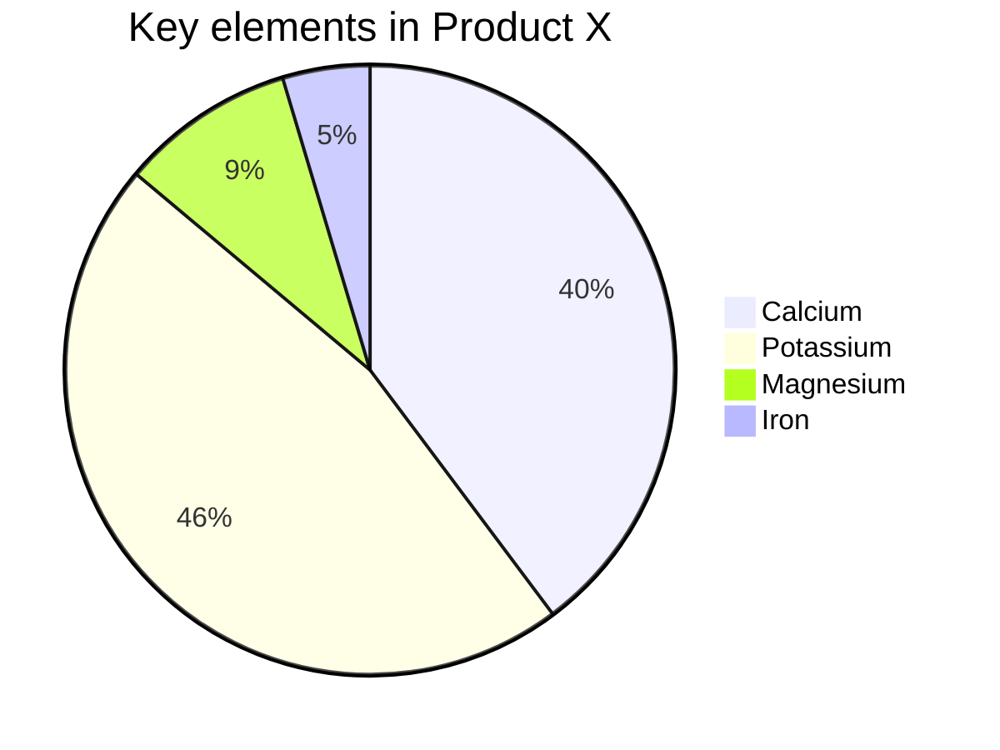

## Flowcharts
#mermaid 
<hr>
Good short list with examples: https://mermaid-js.github.io/mermaid/#/

This declares the graph is oriented from top to bottom (`TD` or `TB` +  `LR`).
More: [Flowcharts](https://mermaid-js.github.io/mermaid/#/flowchart)
```md
(add mermaid after ticks)
graph TD
    Start --> Stop
```



## Sequence Diagram
More: [sequence diagram](https://mermaid-js.github.io/mermaid/#/sequenceDiagram)
```md
sequenceDiagram
    Alice->>+John: Hello John, how are you?
    Alice->>+John: John, can you hear me?
    John-->>-Alice: Hi Alice, I can hear you!
    John-->>-Alice: I feel great!
```




| Type | Description                                      |
| ---- | ------------------------------------------------ |
| ->   | Solid line without arrow                         |
| -->  | Dotted line without arrow                        |
| ->>  | Solid line with arrowhead                        |
| -->> | Dotted line with arrowhead                       |
| -x   | Solid line with a cross at the end               |
| --x  | Dotted line with a cross at the end.             |
| -)   | Solid line with an open arrow at the end (async) |
| --)  | Dotted line with a open arrow at the end (async) |

## Class diagram

| Type  | Description   |
| ----- | ------------- |
| <\|-- | Inheritance   |
| \*--  | Composition   |
| o--   | Aggregation   |
| -->   | Association   |
| --    | Link (Solid)  |
| ..>   | Dependency    |
| ..\|> | Realization   |
| ..    | Link (Dashed) |


More: [class diagram](https://mermaid-js.github.io/mermaid/#/classDiagram)
```md
 classDiagram
      Animal <|-- Duck
      Animal <|-- Fish
      Animal <|-- Zebra
      Animal : +int age
      Animal : +String gender
      Animal: +isMammal()
      Animal: +mate()
      class Duck{
          +String beakColor
          +swim()
          +quack()
      }
      class Fish{
          -int sizeInFeet
          -canEat()
      }
      class Zebra{
          +bool is_wild
          +run()
      }
```


## State diagram
More: [state diagram](https://mermaid-js.github.io/mermaid/#/stateDiagram)
```md
stateDiagram-v2
    [*] --> Still
    Still --> [*]

    Still --> Moving
    Moving --> Still
    Moving --> Crash: hits something
    Crash --> [*]
```


## Gantt
More: [Gantt](https://mermaid-js.github.io/mermaid/#/gantt)
```md
gantt
    dateFormat  YYYY-MM-DD
    title       Adding GANTT diagram functionality to mermaid
    excludes    weekends
    %% (`excludes` accepts specific dates in YYYY-MM-DD format, days of the week ("sunday") or "weekends", but not the word "weekdays".)

    section A section
    Completed task            :done,    des1, 2014-01-06,2014-01-08
    Active task               :active,  des2, 2014-01-09, 3d
    Future task               :         des3, after des2, 5d
    Future task2              :         des4, after des3, 5d

    section Critical tasks
    Completed task in the critical line :crit, done, 2014-01-06,24h
    Implement parser and jison          :crit, done, after des1, 2d
    Create tests for parser             :crit, active, 3d
    Future task in critical line        :crit, 5d
    Create tests for renderer           :2d
    Add to mermaid                      :1d

    section Documentation
    Describe gantt syntax               :active, a1, after des1, 3d
    Add gantt diagram to demo page      :after a1  , 20h
    Add another diagram to demo page    :doc1, after a1  , 48h

    section Last section
    Describe gantt syntax               :after doc1, 3d
    Add gantt diagram to demo page      :20h
    Add another diagram to demo page    :48h
```

```md
gantt
    title A Gantt Diagram
    dateFormat  YYYY-MM-DD
    section Section
    A task           :a1, 2014-01-01, 30d
    Another task     :after a1  , 20d
    section Another
    Task in sec      :2014-01-12  , 12d
    another task      : 24d
```


## Pie chart
Drawing a pie chart is really simple in mermaid.

-   Start with `pie` keyword to begin the diagram
-   Followed by `title` keyword and its value in string to give a title to the pie-chart. This is **_OPTIONAL_**
-   Followed by dataSet
    -   `label` for a section in the pie diagram within `" "` quotes.
    -   Followed by `:` colon as separator
    -   Followed by `positive numeric value` (supported upto two decimal places)

[pie] [title] [titlevalue] (OPTIONAL) "[datakey1]" : [dataValue1] "[datakey2]" : [dataValue2] "[datakey3]" : [dataValue3] . .

```md
pie
    title Key elements in Product X
    "Calcium" : 42.96
    "Potassium" : 50.05
    "Magnesium" : 10.01
    "Iron" :  5
```
