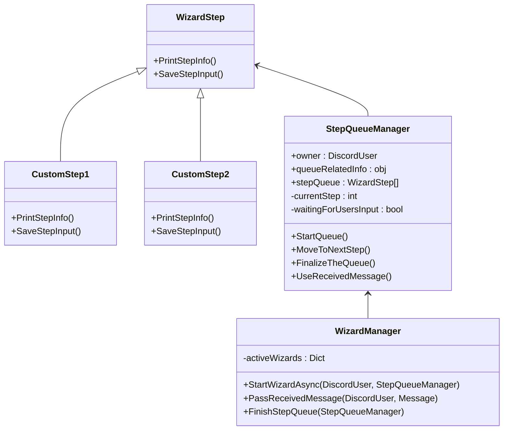

# Wizard
#feature

This document explains what Wizard is and how and when its used. Also it explains technical implementation of the wizard.

## Wizard explanation

Wizard is simply an interactive UI for command invoking person to work with. Wizard lets people to go through setup of certain functionality with a step by step approach, instead of having to bundle a lot of settings into a single argument for their invoked command. Think of it as a setup wizard when you have to install an application inside your computer.

Wizard works by giving the command invoker an Embed message with clear instructions what input from the user is awaited. If wizard is waiting for "yes"/"no" answer - that should be implemented by waiting for an emoji or button press.

Wizard also should tell how many steps are left. Potential #future feature could be implementing a possibility to move from step to step.

At the end it is expected that the wizard will show a final view of all the inputs given to double check for the user if everything they wrote is correct.

## Implementation

In my head wizard implementation looks something like this:

`WizardStep` class is being inherited like an interface by developer defined steps. Then these steps are added to the main `StepQueueManager`. Once command to invoke a wizard is called, the mentioned custom steps are created with information they need to work and added to `StepQueueManager` which is sent alongside user information to `WizardManager`. Wizard controller is running in async mode where it sends a message to user, waits for their response and move to the next step. It is expected that the last step is also defined by developer but it just sends user an information about final result and lets user to double check if input information is correct.

The most tricky part is to pass information from user input to the queue, as it is expected, that whole queue system runs in async/custom threads. Once wizard initiated and any of the steps are displayed to the user, `StepQueueManager` waits for user input by setting `waitingForUsersInput` to true. Once input is received and applied to the current step using `SaveStepInput`, it is possible to set this bool to false and continue thread and move to the next step.

For now its okay to implement this system only for text based input, later we could adapt to emoji/buttons.

%% List of todos todo things. Keeping this list as comment makes them appear in the main todo plugin browser, but does not render in Preview document window %%